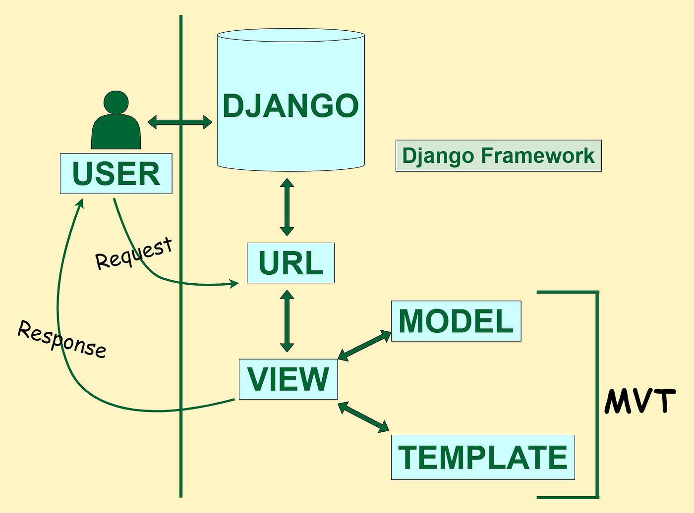
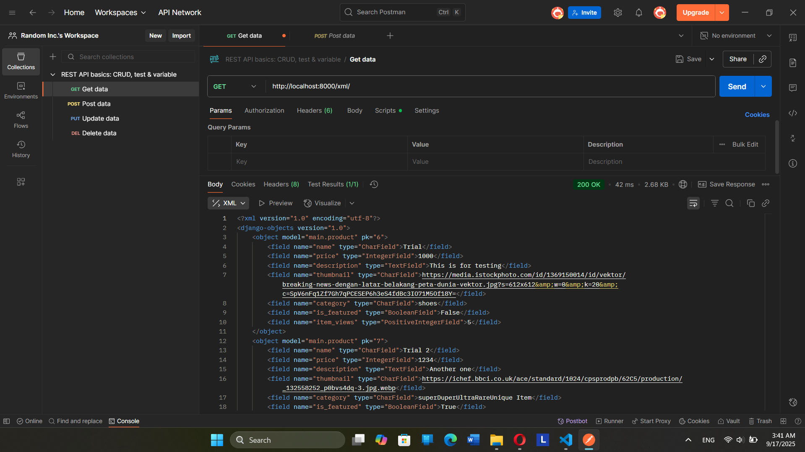
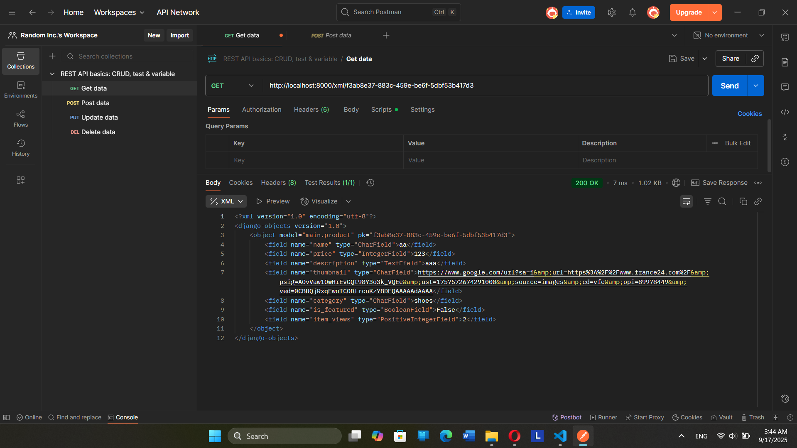
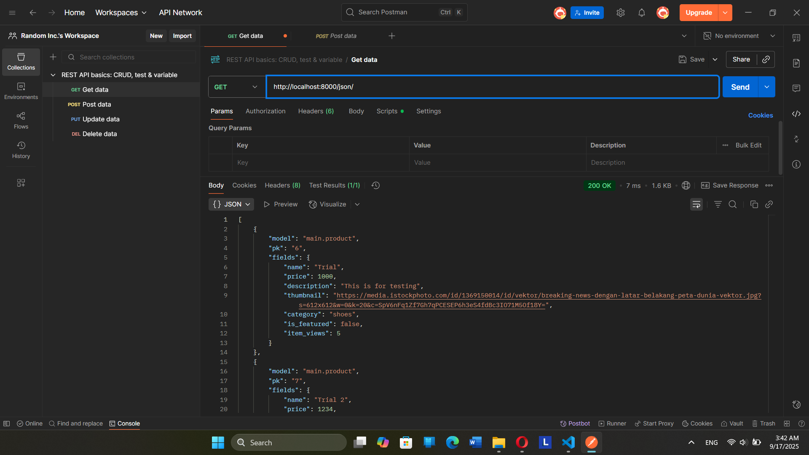
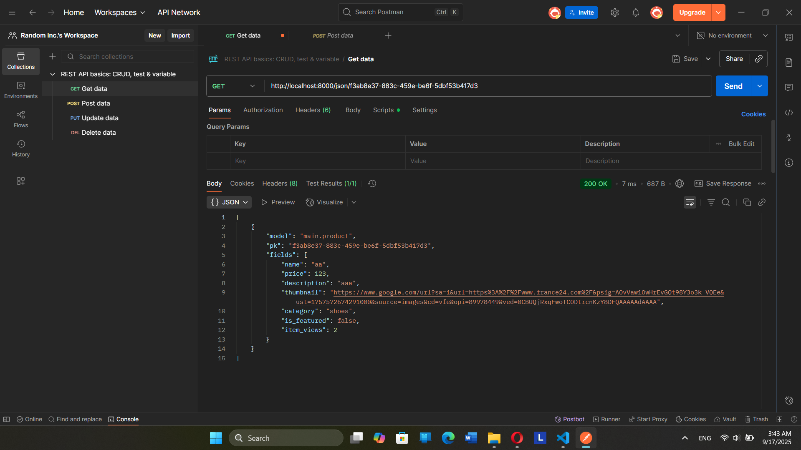

Tugas 1

Jelaskan bagaimana cara kamu mengimplementasikan checklist di atas secara step-by-step
Pertama, kita membuat direktori baru di penyimpanan lokal dan juga github
Kedua, Menghubungkan direktori lokal dan github agar menjaga konsistensi
Ketiga, saya melakukan branching agar dapat menyimpan perubahan tanpa harus mengubah file-file di branch utama
Keempat, saya mengaktifkan virtual environment agar mengisolasi package serta dependencies dari aplikasi agar tidak bertabrakan dengan versi lain yang ada di komputer.
Kelima, saya menyiapkan Dependencies melalui requirements.txt lalu membuat proyek Django
Keenam, membuat file variable environment yang memungkinkan kode yang sama berjalan di environment berbeda tanpa perlu mengubah kode
Ketuju, memodifikasi isi variable environment sesuai dengan kredensial database saya dan juga memodifikasi Allowed_host dan database di settings.py
Kedelapan, Saya membuat deployment melalui PWS dan menambahkan kredensial database di raw editor di PWS dengan SCHEMA tugas_individual dan juga mengedit settings.py untuk menambahkan url website di Allowed_host
Kesembilan, menjalankan PWS untuk Git Kredensial Manajer agar proyek dapat dijalankan melalui PWS

*** Melakukan routing pada proyek agar dapat menjalankan aplikasi main. --- DONE ***
*** Membuat sebuah proyek Django baru --- DONE ***
*** Melakukan deployment ke PWS terhadap aplikasi yang sudah dibuat sehingga nantinya dapat diakses oleh teman-temanmu melalui Internet. --- DONE ***

Kesepuluh, membuat aplikasi dengan nama main yang akan berisikan struktur awal Django lalu mendaftarkan main ke 
Installed_apps di settings agar dapat mendaftarkan aplikasi main ke dalam proyek.

*** Membuat aplikasi dengan nama main pada proyek tersebut. --- DONE ***

Kesebelas,  membuat direktori templates yang berisi main.html
Keduabelas, mengubah isi models.py dengan nama fungsi Product dan memiliki atribut yang diinginkan beserta category choices yang di inginkan

*** Membuat model pada aplikasi main dengan nama Product dan memiliki atribut wajib --- DONE ***

Keduabelas, melakukan migrations untuk mengubah struktur tabel basis data sesuai dengan perubahan model yang didefinisikan dalam kode terbaru
Ketigabelas, mengedit file views.py agar memiliki fungsi show_main yang menerima parameter request. Fungsi ini akan mengatur permintaan HTTP dan mengembalikan tampilan yang sesuai. Di sini juga memberikan return render berfungsi untuk me-render tampilan main.html
Keempatbelas, mengedit file main.html di templates agar dapat menampilkan data dari model 

***  Membuat sebuah fungsi pada views.py untuk dikembalikan ke dalam sebuah template HTML yang menampilkan nama aplikasi serta nama dan kelas kamu. --- DONE ***

Kelimabelas, mengedit file urls.py di direktori main yang berfungsi untuk menghubungkan URL kosong ('') dengan fungsi show_main yang berada di dalam aplikasi bernama main
Keenambelas, mengedit file urls.py di fantasy_shop di bagian urlpatterns untuk menambahkan rute URL untuk mengarahkan ke tampilan main

*** Membuat sebuah routing pada urls.py aplikasi main untuk memetakan fungsi yang telah dibuat pada views.py. --- DONE ***

Ketujuhbelas, melakukan add, commit, push ke git dan pws

Buatlah bagan yang berisi request client ke web aplikasi berbasis Django beserta responnya dan jelaskan pada bagan tersebut kaitan antara urls.py, views.py, models.py, dan berkas html.
https://miro.medium.com/v2/resize:fit:1400/1*XohhamnRotq53fQaY5HQfA.png

    User: Pengguna adalah client yang memulai interaksi. Ia mengirimkan request (permintaan) melalui browser ke aplikasi Django.

    URL: Setiap request dari pengguna akan diterima oleh sistem URL sebagai dispatcher dari Djanggo, URL ini berfungsi untuk mencocokkan URL yang diminta dengan pola yang telah di definisikan di dalam file urls.py. Setelah dicocokkan, URL akan mengarahkan permintaan ke view yang sesuai

    View: View akan menerima permintaan dari URL. View ini berfungsi untuk memproses permintaan dari URL, permintaan ini mungkin mengharuskan view untuk berinteraksi dengan Model untuk mengambil atau menyimpan data, melakukan perhitungan, atau memvalidasi input dari pengguna. Setelah selesai, view akan memilih template yang tepat untuk menampilkan hasil

    Model: Model merupakan representasi data dari aplikasi. Model berfungsi untuk berinteraksi dengan database dan mengambil data yang diminta oleh view lalu dikirim lagi ke view. Di database, kita akan mendefinisikan struktur data, hubungan antar data, dan cara data tersebut diakses.

    Template: Template berfungsi untuk memperlihat data yang diterima dari view. Template akan menghasilkan halaman HTML akhir yang akan dikirim kembali ke pengguna.

Jelaskan peran settings.py dalam proyek Django!
    settings.py memiliki peran untuk menkontrol bagaimana proyek django bekerja, mulai dari mendaftarkan aplikasi, mengelola url, keamanan, dan lain halnya. Di tugas 2, hal yang di ubah dari settings.py yaitu menambahkan main di INSTALLED_APPS sehingga aplikasi main yang kita buat dapat dimuat aplikasinya, kita juga menambahkan ALLOWED_HOSTS yang berfungsi sebagai nama domain yang dapat memuat aplikasi kita.

Bagaimana cara kerja migrasi database di Django?
    Proses migrasi melibatkan 2 tahap yaitu makemigrations dan migrate. Makemigrations berfungsi untuk membuat file yang berisikan perubahan model yang belum di aplikasikan ke dalam basis data. Tahap kedua yaitu migrate, migrate ini berfungsi untuk mengaplikasihkan perubahan yang ada dalam file yang telah dibuat dari makemigrations. Migrasi merupakan cara Django melacak perubahan pada model basis data.

Menurut Anda, dari semua framework yang ada, mengapa framework Django dijadikan permulaan pembelajaran pengembangan perangkat lunak?
    Menurut Saya, alasan mengapa Djanggo digunakan sebagai permulaan karena Django ini memiliki banyak fitur untuk membangun web sehingga tidak memerlukan waktu yang banyak untuk menelusuri library di internet untuk di import. Django juga memakai pendekatan MVT model yang dapat membantu pemula untuk memahami setiap bagian dari aplikasi web yang terhubung satu sama lain.

Apakah ada feedback untuk asisten dosen tutorial 1 yang telah kamu kerjakan sebelumnya?
    Sejauh ini, selama saya mengikuti tutorial 1 dengan tidak banyak kendala dan asisten dosennya cukup aktif dalam membantu dalam menyelesaikan masalah khususnya waktu kemarin ketika tutorial 0 yang saya beberapa kali bermasalah.

Tugas 3

Jelaskan mengapa kita memerlukan data delivery dalam pengimplementasian sebuah platform?
    Karena data delivery dapat memastikan data yang benar dan dibutuhkan dapat diakses oleh pengguna atau sistem yang tepat, pada waktu yang tepat sehingga sebuah aplikasi dapat beroperasi secara optimal

Menurutmu, mana yang lebih baik antara XML dan JSON? Mengapa JSON lebih populer dibandingkan XML?
    JSON, karena data di JSON lebih mudah untuk dibaca dimana langsung dapat melihat isi dari field dibandingkan XML. JSON lebih populer dikarenakan lebih sederhana dan ringkas dibandingkan XML yang lebih detail dan kompleks strukturnya. JSON juga memiliki ukuran yang lebih kecil dibandingkan XML

Jelaskan fungsi dari method is_valid() pada form Django dan mengapa kita membutuhkan method tersebut?
    method is_valid() digunakan untuk memvalidasi data yang dikirim. is_valid() ini dapat membantu untuk menjaga database agar terhindar dari data yang tidak cocok ataupun berbahaya sehingga dapat terhindar dari serangan siber dan juga dapat membantu isi data di dalam aplikasi tetap konsisten

Mengapa kita membutuhkan csrf_token saat membuat form di Django? Apa yang dapat terjadi jika kita tidak menambahkan csrf_token pada form Django? Bagaimana hal tersebut dapat dimanfaatkan oleh penyerang?
    csrf_token ini berfungsi untuk melindungi kita dari serangan csrf. Jika tidak menggunakan csrf_token, django tidak dapat membedakan permintaan yang sah dan permintaan palsu dari penyerang. Tanpa csrf_token, penyerang dapat menipu pengguna yang sudah login ke sebuah situs web untuk secara tidak sadar melakukan tindakan yang tidak diinginkan

Jelaskan bagaimana cara kamu mengimplementasikan checklist di atas secara step-by-step (bukan hanya sekadar mengikuti tutorial).
    Saya membuat skeleton di root folder yang menjadi dasar web lainnya di proyek dengan nama base.html, menambahkannya ke templates di file settings agar teregister sebagai berkas templates.
    Lalu saya membuat file forms.py yang digunakan untuk menerima input yang akan berguna untuk menambahkan item untuk shop, field di forms.py sesuai dari models.py.
    Kemudian, saya menambahkan beberapa fungsi di views.py yang berfungsi untuk menampilkan item, membuat item, menampilkan semua isi yang ada di database. Lalu saya tambahkan path di urls.py untuk create_item dan show_item agar urlnya dapat diakses.
    Lalu saya menambahkan kode di main.html, kodenya mirip dengan di template yang diberikan tapi saya mengedit beberapa hal agar sesuai dengan models.py dan juga views.py. Di main.html, akan muncul tombol untuk add item, item yang sudah terdaftar beserta gambarnya, views, featured, dan juga bisa tekan tombol untuk detail tiap item

*** Membuat halaman yang menampilkan data objek model yang memiliki tombol "Add" yang akan redirect ke halaman form, serta tombol "Detail" pada setiap data objek model yang akan menampilkan halaman detail objek. --DONE ***

    Kemudian saya membuat berkas html untuk create_item dan detail_item di templates di main agar dapat masuk ke web untuk ketika menekan add item dan detail di main.html akan dimasukkan ke web yang berisikan hal untuk membuat item dan detail tiap item. di html create_item akan mengambil fields dari forms.py dengan cara form.as_table. Untuk detail_item akan menunjukkan deskripsi item dan lainnya yang sebelumnya telah ditunjukkan di main.html.

***  Membuat halaman form untuk menambahkan objek model pada app sebelumnya. --DONE ***
*** Membuat halaman yang menampilkan detail dari setiap data objek model. --DONE ***

    Selanjutnya, saya menambahkan fungsi untuk mengembalikan data dalam bentuk XML, JSON, XML by ID, JSON by ID di views.py dengan isi function menyimpan data hasil query dalam bentuk XML dan JSON, lalu untuk id saya menambahkan variable id di model agar dapat membuat id yang unik dan tidak bernama 1,2,3,4,.... Kemudian saya tambahkan path di urls.py agar dapat diakses. 

*** Tambahkan 4 fungsi views baru untuk melihat objek yang sudah ditambahkan dalam format XML, JSON, XML by ID, dan JSON by ID. --- DONE ***
*** Membuat routing URL untuk masing-masing views yang telah ditambahkan pada poin 1. --DONE ***

    Setelah selesai melakukan semuanya, saya melakukan add, commit, dan push ke github dan pws

*** Melakukan add-commit-push ke GitHub --DONE ***

Apakah ada feedback untuk asdos di tutorial 2 yang sudah kalian kerjakan?
    Sejauh ini tidak ada karena penjelasan di tutorial sudah cukup jelas

SCREENSHOT POSTMAN

*** Mengakses keempat URL di poin 2 menggunakan Postman, membuat screenshot dari hasil akses URL pada Postman, dan menambahkannya ke dalam README.md. --DONE ***

Tugas 4
Apa itu Django AuthenticationForm? Jelaskan juga kelebihan dan kekurangannya.
    AuthenticationForm merupakan sebuah fitur dari django yang menyediakan html untuk login yang secara otomatis menangani validasi pengguna dan otentikasi pengguna.

    Kelebihan dari AuthenticationForm dari django ini merupakan kemudahannya untuk di implementasikan dan tidak menghabiskan waktu yang lama untuk pengembangkannya. Tidak hanya itu, keamanannya juga terjamin dan memiliki validasi otomatis yang akan muncul jika salah yang mengeluarkan pesan kesalahan sehingga tidak perlu membuat kode tambahan.

    Kekurangan dari AuthenticationForm ini yaitu kurang fleksibel jika ingin menambahkan modifikasi sehingga harus membuat form baru yang harus dimodifikasi sendiri. Kekurangannya juga jika kita ingin mengimplementasikan suatu hal yang lebih kompleks akan membutuhkan library lain dan membuat implementasi yang khusus. 

Apa perbedaan antara autentikasi dan otorisasi? Bagaiamana Django mengimplementasikan kedua konsep tersebut?
    Perbedaannya yaitu autentikasi digunakan untuk memvalidasi pengguna dan otorisasi untuk ijin yang diberikan pengguna untuk melakukan suatu aksi dalam aplikasi. misalnya, setelah login sebagai pengunjung, kita hanya dapat melakukan pembelian dan tidak dapat menghapus item tersebut dari aplikasi yang hanya dapat dilakukan oleh admin dan penjual.

    Cara django mengimplementasikan kedua hal tersebut yaitu dengan sebuah fitur bawaan yang dapat dilakukan dengan django.contrib.auth untuk autentikasi django akan mengautentikasi pengguna terhadap data yang tersimpan di database. Kalau cocok, pengguna dianggap terautentikasi, dan django akan membuat sesi untuknya.
    
    Cara django mengimplementasikan atorisasi yaitu dengan django.contrib.auth yang dapat implementasinya dapat dilakukan dengan beberapa hal seperti dekorator (seperti yang digunakan di tutorial dan tugas yaitu @login_required), permissions, dan group.

Apa saja kelebihan dan kekurangan session dan cookies dalam konteks menyimpan state di aplikasi web?
    Session
    Kelebihan dari session yaitu data sensitif tidak akan disimpan dalam website sehingga mengurangi risiko pencurian data. Tidak hanya itu, session tidak memiliki batas data yang dapat disimpan karena data ada di dalam server serta pengembang memiliki kontrol penuh terhadap data sesi dan durasi berlakunya.
    Kekurangannya yaitu setiap sesi memerlukan penyimpanan dari server yang dapat menjadi beban terutama jika banyak pengguna. Kekurangannya juga jika dalam lingkungan yang kompleks akan menjadi lebih susah untuk mengelola data dari sesi yang disimpan.

    Cookies
    Kelebihan dari cookies yaitu implementasinya cukup mudah dan terutama untuk menyimpan data non-sensitif dan kecil. Kelebihan dari cookies juga yaitu server tidak perlu menyimpan state di sisi server untuk setiap pengguna ketika mengimplementasikan cookies.
    Kekurangan dari cookies yaitu data yang disimpan cukup kecil dan pengguna dapat menghapus cookie secara manual yang akan menghilangkan state yang tersimpan. Tidak hanya itu, cookies juga memiliki kekurangan jika ada banyak request, cookie akan dikirimkan kembali ke server yang dapat menjadi overhead pada jaringan serta data cookies dapat dicuri jika terkena serangan di sisi client.

Apakah penggunaan cookies aman secara default dalam pengembangan web, atau apakah ada risiko potensial yang harus diwaspadai? Bagaimana Django menangani hal tersebut?
    Penggunaan cookies tidak aman secara default dalam pengembangan web karena ada beberapa risiko terutama karena cookies disimpan di client. Risiko ada beberapa seperti pencurian cookies sehingga penyerang dapat menggunakan cookies client untuk meniru client dan mengakses akun mereka. Cookies juga dapat dimanipulasi sehingga dapat menyebabkan pelanggaran keamanan dan perilaku aplikasi dapat menjadi tidak terduga. Cookies juga memiliki risiko dapat diakses oleh pihak ketiga yang berada di jaringan yang sama jika data tidak di enkripsi. Cara django menghadapi hal tersebut yaitu dengan melakukan enkripsi sesi yang dengan cara menyimpan ID sesi yang unik di cookie pengguna sehingga dapat mencegah pencurian atau manipulasi data sensitif. Django juga melakukan manajemen sesi sehingga memungkinkan untuk mengatur durasi sesi dan menghapus sesi saat pengguna logout.

Jelaskan bagaimana cara kamu mengimplementasikan checklist di atas secara step-by-step (bukan hanya sekadar mengikuti tutorial).
    Pertama, saya membuat function register, login_user, dan logout_user yang akan mereturn ke halaman html dan akan menghapus cookie sebelum di kirim ke halaman login untuk function logout_user. Di login_user, nanti akan menyimpan cookie bernama last_login.
    Kedua, Saya membuat halaman html untuk register dan login lalu menyambungkan html dengan views dengan cara menambahkan path di urls.

*** Mengimplementasikan fungsi registrasi, login, dan logout untuk memungkinkan pengguna mengakses aplikasi sebelumnya sesuai dengan status login/logoutnya. -DONE ***

    Ketiga, saya memasukkan dekorator di views untuk show_main dan shows_item agar harus login dulu agar dapat diakses, di show_main juga saya menambahkan di context yang meminta cookie kapan login terakhir dan meminta user yang sedang login. Lalu, saya mengedit main.html dengan menambahkan waktu last_login kapan, tombol logout, dan juga delete (masih belum ada implementasi), dan nama user yang sedang login.

*** Menampilkan detail informasi pengguna yang sedang logged in seperti username dan menerapkan cookies seperti last_login pada halaman utama aplikasi. -DONE ***

    Keempat, saya menyambungkan product dengan user dengan mengedit models dengan menambahkan user agar akan ada relationship antara item dengan user. Lalu saya mengedit create_news yang akan meminta user dan show_main yang akan memiliki opsi filter (Filter di sini yaitu item yang di buat oleh user tersebut) di halaman utama. Saya mengedit halaman utama untuk menunjukkan tombol filter dan mengedit item_detail.html yang akan menunjukkan nama user di halaman paling bawah.

*** Membuat dua (2) akun pengguna dengan masing-masing tiga (3) dummy data menggunakan model yang telah dibuat sebelumnya untuk setiap akun di lokal. -DONE ***
***  Menghubungkan model Product dengan User. -DONE ***